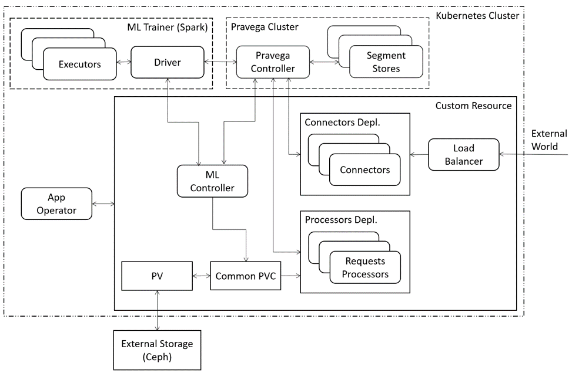

## Specification

Description of resources:
- Connectors Deployment - the server, which receives data from users, sends it to Pravega 
and returns a result, when it is ready.
- Processors Deployment - processing all messages from Pravega. It uses trained ML model from Common PVC. 
- ML-Controller - collecting dataset, training and saving ML model to Common PVC.
- ML-Trainer - resource for parallel training.
- App-operator - controller for custom resource.