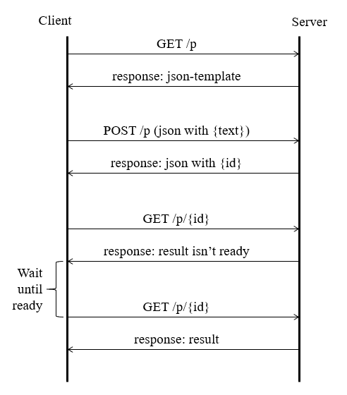

## Usage scenario



This scheme shows a default usage scenario. 
A client app send a POST-request with a message text for processing. 
The server responds with the id, which is used for getting result. 
Then client app can send GET-requests with some period until the server returns a result.

## REST API overview

BasePath : /v1

Schemes : HTTP
        
| Request | Responce |
|---------|----------|
|GET /v1| info|
|GET /v1/p| json template|
|POST /v1/p {json with message text}| {json with id}|
|GET /v1/p/<id>| result html|

JSON template:

```json
{
    "id": "...",
    "text": "..."
}
```